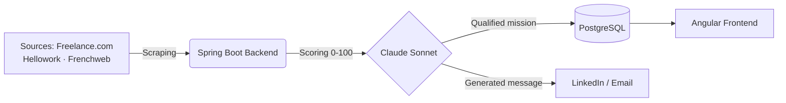

[🇫🇷 Français](README.md) · 🇬🇧 **English**

### 📬 [Contact me on LinkedIn](https://linkedin.com/in/riadhmnasri) · Day rate €700–900 · Remote / Hybrid · Paris

---

## 📑 Table of Contents

[About Me](#about-me) · [Tech Stack](#tech-stack) · [Education](#formation) · [Certifications](#certifications) · [Open Source Libraries](#open-source-libraries) · [Featured Projects](#featured-projects) · [Recommendations](#recommandations) · [LinkedIn Posts](#posts-linkedin) · [Blog](#blog) · [GitHub Stats](#github-stats) · [Contact](#contact)

---

## 👋 About Me

**Senior Tech Lead & Architect Java** with **20+ years of experience** designing and delivering critical distributed systems, from market finance (SGCIB) to startups.

I combine deep backend expertise (Java · Kotlin · Spring Boot · Microservices) with AI tooling adoption (Claude AI · MCP) to deliver scalable, maintainable architectures with strong business impact.

| 👥 Leadership | 📈 Scale | 🔧 Impact |
|:---|:---|:---|
| Tech Lead for teams of 10+ developers (SGCIB, BforBank) | Critical real-time systems in market finance, several million transactions | Legacy architecture modernization · reduced technical debt and incidents · faster delivery |

- 🏗️ **Specialty**: Microservices Architecture · DDD · Event-driven · Hexagonal
- 🤖 **AI Tooling**: Claude API (Anthropic) · autonomous agents · Semantic Kernel · MCP
- ☁️ **Cloud**: AWS · GCP · Terraform · Docker
- 🧑‍🏫 **Speaker / Trainer**: JUG Paris · Devoxx · BBL · Meetup
- ✍️ **Author**: Several technical articles published in [Programmez](https://programmez.com) magazine
- 🗣️ **Languages**: French (native) · English (fluent)
- 📍 **Paris** · Remote / Hybrid

---

## 🛠️ Tech Stack

### Backend

### Architecture & Messaging

### Frontend

### AI & Agents

### Exploring

### Cloud & DevOps

---

## 🎓 Education

| Degree | School | Year |
|---------|-------|-------|
| **Executive Master · Digital Transformation Strategy** | 🏛️ **École Polytechnique** | 2024 |
| **Engineering Degree in Computer Science** | 🏛️ **EMI** | 2004 |

---

## 🏆 Certifications

### ⭐ Key certifications

| Certification | Organization | Year |
|--------------|-----------|-------|
| **Spring Certified Professional** | VMware | 2012 |
| **Sun Certified Java Programmer (SCJP)** | Sun Microsystems | 2007 |
| **AI-Augmented Developer (Generative AI)** | SFEIR Institute | 2025 |
| **Claude Code in Action** | Anthropic | 2026 |
| Gen AI: Unlock Foundational Concepts | Google Cloud | 2025 |
| Kotlin for Java Developers | Coursera | 2020 |

📋 Other courses (14)

| Certification | Organization | Year |
|--------------|-----------|-------|
| Claude Code 101 | Anthropic | 2026 |
| Introduction to Subagents | Anthropic | 2026 |
| Introduction to Agent Skills | Anthropic | 2026 |
| Discovering Anthropic's Claude AI | LinkedIn | 2026 |
| AI: Beyond the Chatbot | Google Cloud | 2025 |
| Apache Spark Essentials | LinkedIn | 2024 |
| Introduction to Generative AI | Google | 2023 |
| Introducing Semantic Kernel | LinkedIn | 2023 |
| Getting Started as an Independent Consultant | LinkedIn | 2023 |
| Discovering Terraform | LinkedIn | 2022 |
| Software Architecture: Domain-Driven Design | LinkedIn | 2021 |
| Google Cloud Platform Essentials | LinkedIn | 2021 |
| JavaScript: The Ultimate Course | Udemy | 2020 |
| Hands-on Angular | Udemy | 2020 |

---

## 📦 Open Source Libraries

### ♟️ [kotlin-chess-tournament](https://github.com/riadh-mnasri/kotlin-chess-tournament)
> Swiss-system chess tournament pairing, Elo rating and standings for Kotlin/JVM

- Swiss pairing (Dutch variant), bye handling, color balancing
- Elo rating calculation and final standings with tiebreaks (Buchholz, Sonneborn-Berger)
- Fills a gap on the JVM/Kotlin side: the only existing Swiss pairing implementations are in C++/Pascal or JavaScript

### 🏦 [kotlin-counterparty-risk](https://github.com/riadh-mnasri/kotlin-counterparty-risk)
> Counterparty credit risk exposure, expected loss and CVA for Kotlin/JVM (teaching/prototyping tool)

- Exposure at default (EAD) via a simplified Basel comprehensive approach with regulatory haircuts, for SFTs
- Expected Loss and simplified CVA
- Credit limit check (OK / WARNING / BREACH), end-to-end `BigDecimal` arithmetic
- Fills a gap in Kotlin/JVM between `finmath-lib`/`Strata` (general analytics) and full regulatory engines

---

## 🚀 Featured Projects

### 🩻 [Hexray](https://github.com/riadh-mnasri/hexray) 
> Architecture audit CLI for TypeScript/Kotlin projects · self-contained HTML report with a Claude-generated executive summary

- Detects layering violations (domain/infrastructure), dependency cycles, test pyramid ratio, dependency freshness
- Prioritizes findings and has Claude synthesize them into an executive summary with recommendations
- Self-contained HTML report, designed to be readable by a client or recruiter in a few seconds
- Hexagonal architecture: pure domain, ports/adapters (dependency-cruiser, Claude; Detekt/ArchUnit planned)

---

### 📡 [Prospection Radar](https://github.com/riadh-mnasri/prospection-radar) 
> AI-powered radar for freelance Tech Leads · detects missions and hidden market signals, scored by Claude AI

- Multi-source scraping (Freelance.com, Hellowork, Frenchweb)
- AI scoring of missions (0–100) based on your profile, via Claude Sonnet
- Hidden market detection: funding rounds, CTO appointments, hiring signals
- Personalized LinkedIn & email message generation by Claude

---

### Other projects

| Project | Description | Stack |
|---|---|---|
| 🧩 [MissionMatch](https://github.com/riadh-mnasri/missionmatch) | Showcases DDD, Hexagonal, TDD/BDD and Event-driven design for freelance/mission matching | Kotlin · Spring Boot · Angular · Kafka · Terraform |
| 📋 [Taskly](https://taskly-frontend-brown.vercel.app) | Gamified task management app for middle schoolers ([demo](https://taskly-frontend-brown.vercel.app)) | Kotlin · Spring Boot · Angular · PostgreSQL |
| 🎓 [Claude Expert](https://claude-expert.vercel.app) | Interactive Claude Code training · 12 modules, 144 quiz questions | Next.js · TypeScript · Tailwind |
| ♟️ [ChessCoach.ai](https://github.com/riadh-mnasri/chesscoach-ai) | AI-powered chess coach · Stockfish analysis and personalized coaching by Claude | Spring Boot · Angular · Claude · Stockfish |

---

## ✍️ Latest LinkedIn Posts

Manually updated via [GitHub Action](.github/workflows/linkedin-posts.yml) (no public LinkedIn RSS feed) · posts are in French

<!-- LINKEDIN-POSTS:START -->
- [Après plus de 20 ans de développement, je ne pensais pas qu'un assistant IA allait encore me faire évoluer dans ma façon](https://www.linkedin.com/posts/riadhmnasri_apr%C3%A8s-plus-de-20-ans-de-d%C3%A9veloppement-je-activity-7484726238239068160-JU5W) · 19 Jul 2026
- 🔗 [Le métier de développeur évolue à vitesse grand V, et la transition vers le…](https://www.linkedin.com/posts/riadhmnasri_claudecode-anthropic-generativeai-activity-7462555144409255937) · *28 May 2026*
- 🔗 [On parle beaucoup d'agents Claude en ce moment, mais on confond souvent quatre…](https://www.linkedin.com/posts/riadhmnasri_llm-claude-agent-activity-7462241443160428544-RraE) · *28 May 2026*
<!-- LINKEDIN-POSTS:END -->

---

## 📝 Latest Blog Posts

Posts are in French

<!-- BLOG-POSTS:START -->
- 📄 [CI/CD + GitHub Actions + Azure](https://techpassionsharing.com/2026/06/05/ci-cd-github-actions-azure/) · *05 Jun 2026*
- 📄 [Kubernetes sur Azure avec Terraform : Du Concept à la Mise en Production](https://techpassionsharing.com/2026/06/04/kubernetes-sur-azure-avec-terraform-du-concept-a-la-mise-en-production/) · *04 Jun 2026*
- 📄 [Maîtriser les Skills Claude et les Adapter à GitHub Copilot : Un Guide Pratique pour Développeurs](https://techpassionsharing.com/2026/06/04/maitriser-les-skills-claude-et-les-adapter-a-github-copilot-un-guide-pratique-pour-developpeurs/) · *04 Jun 2026*
<!-- BLOG-POSTS:END -->

---

## 📊 GitHub Stats

📈 More stats (languages, activity, trophies)

---

## 🗣️ Recommendations

> "I had the privilege of working with Riadh at BforBank. Riadh is passionate about his work. He likes learning new techniques and technologies to keep improving. He's able to fit perfectly into any environment."
>
> **Dimitri Kahn** · Full Stack Developer at Edelia (EDF Group) · worked with Riadh on the same team

> "I had the pleasure to work with Riadh. He is a strong and passionate Java and Kotlin developer. Quality and work done right are very important for him. He also likes to discover and explore new frameworks and technologies. He is also a great speaker, sharing his knowledge at tech events (like BBL, Brown Bag Lunch). If you're looking for a strong senior developer, I would warmly recommend Riadh."
>
> **Romain Schlick** · Technical Leader & Senior Developer (Java/Kotlin/Spring/AWS) · worked with Riadh on the same team

> "Riadh worked on my team on strategic projects and showed, throughout his engagement, a clear taste for technical depth as well as the ability to step back and analyze in a way that created real added value. I also appreciated Riadh's personality — he integrated very well into an established team while proposing and defending his opinions constructively."
>
> **David Martin** · Customer Success, Professional Services, Presales & Support Director · Riadh's direct manager

Recommendations from LinkedIn · [see all my recommendations →](https://linkedin.com/in/riadhmnasri)

---

## 💬 Contact & Missions

Available for **Tech Lead Java / Architect** missions, remote / hybrid.

**Day rate: €700–900** · Long-term missions · Remote / Hybrid · Paris

---

  <i>Built with ❤️ by Riadh MNASRI</i>

