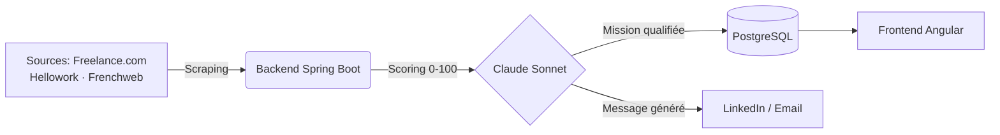

🇫🇷 **Français** · [🇬🇧 English](README.en.md)

### 📬 [Me contacter sur LinkedIn](https://linkedin.com/in/riadhmnasri) · TJM 700–900 €/j · Remote / Hybride Paris

---

## 📑 Sommaire

[About Me](#about-me) · [Tech Stack](#tech-stack) · [Formation](#formation) · [Certifications](#certifications) · [Open Source Libraries](#open-source-libraries) · [Featured Projects](#featured-projects) · [Posts LinkedIn](#posts-linkedin) · [Blog](#blog) · [GitHub Stats](#github-stats) · [Contact](#contact)

---

## 👋 About Me

**Senior Tech Lead & Architect Java** avec **20+ ans d'expérience** dans la conception et le delivery de systèmes distribués critiques, de la finance de marché (SGCIB) aux startups.

Je combine expertise backend profonde (Java · Kotlin · Spring Boot · Microservices) et adoption des outils IA (Claude AI · MCP) pour livrer des architectures scalables, maintenables, et à fort impact business.

- 🏗️ **Spécialité** : Architecture microservices · DDD · Event-driven · Hexagonal
- 🤖 **AI Tooling** : Claude API (Anthropic) · agents autonomes · Semantic Kernel · MCP
- ☁️ **Cloud** : AWS · GCP · Terraform · Docker
- 🧑‍🏫 **Speaker / Formateur** : JUG Paris · Devoxx · BBL · Meetup
- 🗣️ **Langues** : Français (natif) · Anglais (courant)
- 📍 **Paris** · Remote / Hybride

---

## 🛠️ Tech Stack

### Backend

### Architecture & Messaging

### Frontend

### AI & Agents

### En exploration

### Cloud & DevOps

---

## 🎓 Formation

| Diplôme | École | Année |
|---------|-------|-------|
| **Executive Master · Stratégie de la Transformation Numérique** | 🏛️ **École Polytechnique** | 2024 |
| **Diplôme d'Ingénieur en Informatique** | 🏛️ **EMI** | 2004 |

---

## 🏆 Certifications

### ⭐ Certifications clés

| Certification | Organisme | Année |
|--------------|-----------|-------|
| **Spring Certified Professional** | VMware | 2012 |
| **Sun Certified Java Programmer (SCJP)** | Sun Microsystems | 2007 |
| **Développeur Augmenté par l'IA Générative** | SFEIR Institute | 2025 |
| **Claude Code in Action** | Anthropic | 2026 |
| Gen AI: Unlock Foundational Concepts | Google Cloud | 2025 |
| Kotlin for Java Developers | Coursera | 2020 |

📋 Autres formations (14)

| Certification | Organisme | Année |
|--------------|-----------|-------|
| Claude Code 101 | Anthropic | 2026 |
| Introduction to Subagents | Anthropic | 2026 |
| Introduction to Agent Skills | Anthropic | 2026 |
| Découvrir Claude IA d'Anthropic | LinkedIn | 2026 |
| IA : au-delà du chatbot | Google Cloud | 2025 |
| L'essentiel d'Apache Spark | LinkedIn | 2024 |
| Introduction to Generative AI | Google | 2023 |
| Introducing Semantic Kernel | LinkedIn | 2023 |
| Se lancer dans le recrutement indépendant | LinkedIn | 2023 |
| Découvrir Terraform | LinkedIn | 2022 |
| Software Architecture: Domain-Driven Design | LinkedIn | 2021 |
| L'essentiel de Google Cloud Platform | LinkedIn | 2021 |
| Javascript: La formation ULTIME | Udemy | 2020 |
| Angular par la pratique | Udemy | 2020 |

---

## 📦 Open Source Libraries

### ♟️ [kotlin-chess-tournament](https://github.com/riadh-mnasri/kotlin-chess-tournament)
> Swiss-system chess tournament pairing, Elo rating and standings for Kotlin/JVM

- Swiss pairing (Dutch variant), bye handling, color balancing
- Elo rating calculation and final standings with tiebreaks (Buchholz, Sonneborn-Berger)
- Fills a gap on the JVM/Kotlin side: the only existing Swiss pairing implementations are in C++/Pascal or JavaScript

### 🏦 [kotlin-counterparty-risk](https://github.com/riadh-mnasri/kotlin-counterparty-risk)
> Counterparty credit risk exposure, expected loss and CVA for Kotlin/JVM (teaching/prototyping tool)

- Exposure at default (EAD) via a simplified Basel comprehensive approach with regulatory haircuts, for SFTs
- Expected Loss and simplified CVA
- Credit limit check (OK / WARNING / BREACH), end-to-end `BigDecimal` arithmetic
- Fills a gap in Kotlin/JVM between `finmath-lib`/`Strata` (general analytics) and full regulatory engines

---

## 🚀 Featured Projects

### 🩻 [Hexray](https://github.com/riadh-mnasri/hexray) 
> CLI d'audit d'architecture pour projets TypeScript/Kotlin · rapport HTML avec résumé exécutif généré par Claude

- Détecte violations de couches (domaine/infrastructure), cycles de dépendances, ratio de la pyramide de tests, fraîcheur des dépendances
- Priorise les findings et les fait synthétiser par Claude en résumé exécutif avec recommandations
- Rapport HTML autonome, pensé pour être lisible par un client ou un recruteur en quelques secondes
- Architecture hexagonale : domaine pur, ports/adapters (dependency-cruiser, Claude ; Detekt/ArchUnit à venir)

---

### 📡 [Prospection Radar](https://github.com/riadh-mnasri/prospection-radar) 
> Radar IA pour Tech Leads freelance · détection de missions et signaux marché caché, scoré par Claude AI

- Scraping multi-sources (Freelance.com, Hellowork, Frenchweb)
- Scoring IA des missions (0–100) selon votre profil, via Claude Sonnet
- Détection marché caché : levées de fonds, nominations CTO, signaux de recrutement
- Génération de messages LinkedIn & email personnalisés par Claude

---

### 🧩 [MissionMatch](https://github.com/riadh-mnasri/missionmatch)
> App de référence pour le matching freelance/missions · démonstrateur DDD, Hexagonal, TDD/BDD et Event-driven

- Matching automatique profil freelance (compétences, TJM, disponibilité) vs missions entrantes, suivi du pipeline jusqu'au contrat signé
- Architecture hexagonale (ports & adapters) sur chaque module backend, DDD avec bounded contexts et ubiquitous language
- Communication événementielle inter-contextes via Kafka
- Infra as Code : déploiement AWS via modules Terraform
- Documentation pédagogique complète (FR/EN) de chaque pratique : DDD, Hexagonal, TDD, BDD

---

### 📋 [Taskly](https://taskly-frontend-brown.vercel.app)
> App de gestion de tâches gamifiée pour collégiens · Kotlin/Spring Boot (hexagonal + DDD) + Angular 18

- Architecture hexagonale + DDD, backend Kotlin/Spring Boot, PostgreSQL
- Kanban, calendrier, statistiques et gamification (XP, badges)
- [Démo live](https://taskly-frontend-brown.vercel.app) (identifiants de démo fournis) · [API](https://taskly-backend-4nh4.onrender.com/swagger-ui.html)

---

### 🎓 [Claude Expert](https://claude-expert.vercel.app)
> Formation interactive pour maîtriser Claude Code · 12 modules, 144 questions de quiz, tableau de bord de progression

- 12 modules progressifs couvrant Claude Code de bout en bout
- 144 questions de quiz avec suivi de progression
- [Démo live](https://claude-expert.vercel.app)

---

### ♟️ [ChessCoach.ai](https://github.com/riadh-mnasri/chesscoach-ai)
> Coach d'échecs propulsé par l'IA · analyse Stockfish et coaching personnalisé par Claude

- Import automatique des parties depuis chess.com et lichess, déduplication
- Analyse coup par coup avec Stockfish 16 (profondeur 20) et classification (brillant / bon / imprécision / erreur / gaffe)
- Coaching en langage naturel par Claude Opus : explication des erreurs, plan de progression personnalisé
- Revue de partie interactive : échiquier synchronisé, barre d'évaluation, explication à la demande

---

## ✍️ Derniers posts LinkedIn

Mis à jour manuellement via [GitHub Action](.github/workflows/linkedin-posts.yml) (pas de flux RSS public LinkedIn)

<!-- LINKEDIN-POSTS:START -->
- [Après plus de 20 ans de développement, je ne pensais pas qu'un assistant IA allait encore me faire évoluer dans ma façon](https://www.linkedin.com/posts/riadhmnasri_apr%C3%A8s-plus-de-20-ans-de-d%C3%A9veloppement-je-activity-7484726238239068160-JU5W) · 19 Jul 2026
- 🔗 [Le métier de développeur évolue à vitesse grand V, et la transition vers le…](https://www.linkedin.com/posts/riadhmnasri_claudecode-anthropic-generativeai-activity-7462555144409255937) · *28 May 2026*
- 🔗 [On parle beaucoup d'agents Claude en ce moment, mais on confond souvent quatre…](https://www.linkedin.com/posts/riadhmnasri_llm-claude-agent-activity-7462241443160428544-RraE) · *28 May 2026*
<!-- LINKEDIN-POSTS:END -->

---

## 📝 Derniers articles du blog

<!-- BLOG-POSTS:START -->
- 📄 [CI/CD + GitHub Actions + Azure](https://techpassionsharing.com/2026/06/05/ci-cd-github-actions-azure/) · *05 Jun 2026*
- 📄 [Kubernetes sur Azure avec Terraform : Du Concept à la Mise en Production](https://techpassionsharing.com/2026/06/04/kubernetes-sur-azure-avec-terraform-du-concept-a-la-mise-en-production/) · *04 Jun 2026*
- 📄 [Maîtriser les Skills Claude et les Adapter à GitHub Copilot : Un Guide Pratique pour Développeurs](https://techpassionsharing.com/2026/06/04/maitriser-les-skills-claude-et-les-adapter-a-github-copilot-un-guide-pratique-pour-developpeurs/) · *04 Jun 2026*
<!-- BLOG-POSTS:END -->

---

## 📊 GitHub Stats

---

## 🏅 GitHub Trophies

---

## 💬 Contact & Mission

Disponible pour des missions **Tech Lead Java / Architecte** en **remote / hybride**.

**TJM : 700–900 €/j** · Missions longues durée · Remote / Hybride · Paris

---

  <i>Built with ❤️ by Riadh MNASRI</i>

